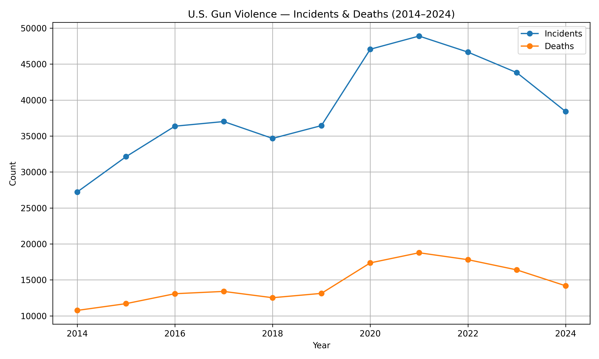
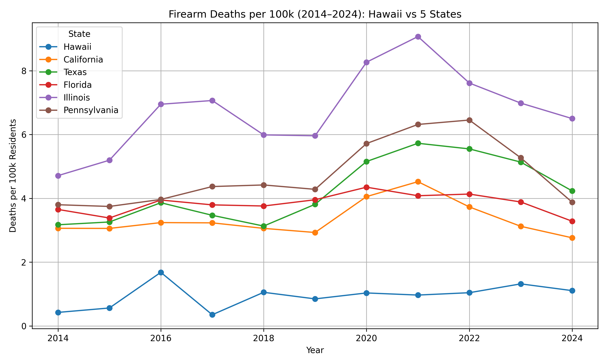
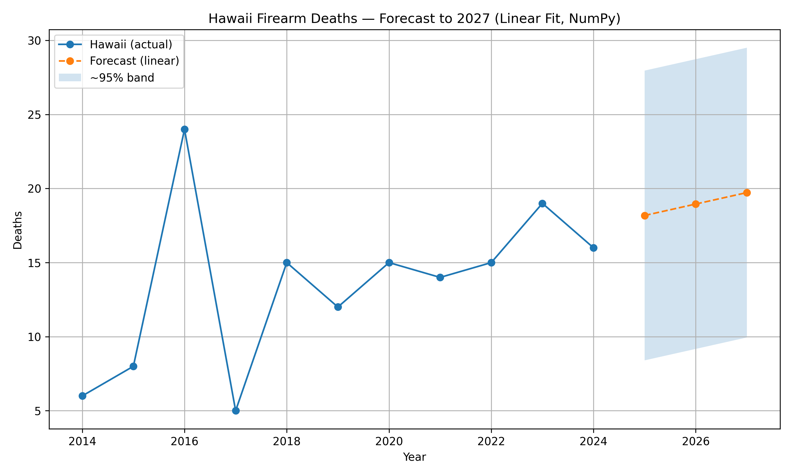

# 🔫 Hawaiʻi Gun Violence Analysis (2014–2024)
**Author:** Johnny Bae  
**Course:** DS495 — Data Science Research  
**Institution:** Chaminade University of Honolulu  
**Instructor:** Dr. Rylan Chong  

A data-driven exploration of firearm violence trends in the U.S., with a focused analysis on Hawaiʻi.  
Includes national patterning, per-capita context, forecasting using linear regression, and prevention-oriented recommendations.

## 📊 Key Visuals

### National Trends

### Hawaiʻi vs. Five States (Per 100k)

### 3-Year Forecast for Hawaiʻi

## 📄 Poster
View the final research poster here:  
[**DS495 Hawaiʻi Gun Violence Poster**](Poster.pdf)
